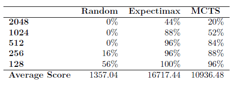

# 2022_AI_Final_project
This is the project for 2022 spring Artificial Intelligence course in National Yang Ming Chao Tung University

We develop a **2048 AI agent**. The algorithm we implemented are Expectimax, Monte Carlo Tree Search, and Deep Q-network

First, execute the following instruction to install the required packages

```
pip3 install -r requirements.txt
```
To execute the web driver in selenium, you have to download the ChromeDriver in https://chromedriver.chromium.org/downloads with version 102, and put it in the project's file

Then, for random agent, expectimax agent, and MCTS agent, execute the game by typing
```
python3 GameDriver.py --random
python3 GameDriver.py --expectimax
python3 GameDriver.py --mcts
```
For DQN agnet, execute the game by typing
```
python3 main.py
```

We set the hyperparameter as the following:
* Expectimax:
    1. Weight: 
    
        [0.135759, 0.121925, 0.102812, 0.099937],
    
        [0.0997992, 0.0888405,  0.076711, 0.0724143],
    
        [0.060654, 0.0562579, 0.037116, 0.0161889],
    
        [0.0125498, 0.00992495, 0.00575871, 0.00335193]
    2. Depth = 2

* MCTS: 
    1. spm_scale_param = 10
    2. sl_scale_param = 4
    3. search_param = 200
    4. search_per_move = spm_scale_param * (1 + (move_number // search_param))
    5. search_length = sl_scale_param * (1 + (move_number // search_param))

* DQN:
    1. GAMMA = 0.99
    2. EXPLORE = 10000
    3. INITIAL_EPSILON = 0.1
    4. FINAL_EPSILON = 0.0001
    5. REPLAY_MEMORY = 50000   ->  Size of replay buffer
    6. BATCH = 16        ->  Length of batch extracted from buff
    
Finally, the experiment result is showed in the following table



Contribution: 

0816138楊卓敏: 33%

109550018郭昀: 33%

109550105張友维: 33%

Youtube Video Link: 
https://youtu.be/-zVEz-IEFsc
